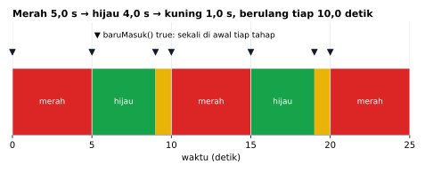
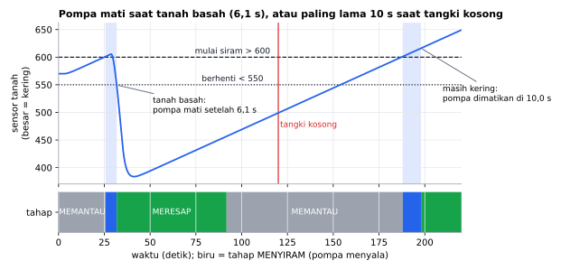

# AlurProgram (English)

[Bahasa Indonesia](README.md)

A tiny Arduino **state machine** for a plain `switch-case` in `loop()`. No callbacks, no transition tables, no dynamic allocation, **7 bytes of RAM**. The API and examples are in Indonesian ("alur program" = "program flow", "tahap" = "stage/state"). This page maps every function to English.

```cpp
#include <AlurProgram.h>

enum { IDLE, RUNNING };
AlurProgram flow(IDLE);

void setup() {
  Serial.begin(115200);
  pinMode(2, INPUT_PULLUP);
}

void loop() {
  switch (flow.tahap()) {                 // state()
    case IDLE:
      if (flow.baruMasuk()) Serial.println("Idle");   // justEntered()
      if (digitalRead(2) == LOW) flow.pindah(RUNNING); // goTo()
      break;

    case RUNNING:
      if (flow.baruMasuk()) Serial.println("Running");
      flow.pindahSetelah(IDLE, 3000);     // goToAfter(state, ms)
      break;
  }
}
```

## Why

- A plain `switch-case` that beginners already know, with your own `enum`.
- Entry actions with `baruMasuk()`, timeouts with `lamaDiTahap()` and `pindahSetelah()`, no extra timer variables.
- 7 bytes of RAM, no heap. Safe across the `millis()` overflow.

From the source of popular English libraries: arduino-fsm (`realloc`), SimpleFSM, StateMachine (jrullan), and StateMachineLib (`new`) all allocate on the heap and are built around callbacks or transition tables. YASM avoids the heap but needs one function per state.

## Simulation results



The `LampuLaluLintas` example run for 25 s: each stage lasts exactly as set by `pindahSetelah()`, and `baruMasuk()` (just entered) is true once at the start of each stage.



The `PenyiramTanaman` example with simulated soil. The pump starts above 600 and stops only below 550 (hysteresis), so a reading wobbling around one threshold cannot toggle it. The first watering stops when the soil is wet (6.1 s). Once the tank is empty the soil never gets wet, and the 10 s `pindahSetelah()` limit switches the pump off.

The plots come from a PC simulation that runs this library's code (`extras/simulasi`): `cd extras/simulasi && python gambar.py` (needs g++ and matplotlib).

## Speed & memory

Measured with simavr (cycle-accurate ATmega328P simulator), Arduino Uno 16 MHz: two stages alternating every second, an action on entering each stage. Cycles per `loop()` pass.

| | AlurProgram 1.0.1 | arduino-fsm 2.2.0 | SimpleFSM 1.3.1 | YASM 1.0.5 |
|---|---|---|---|---|
| Waiting | 68 (4 µs) | 185 | 230 | 80 |
| Changing stage | 118 (7 µs) | 387 | 312 | 120 |
| RAM | 7 B | 23 B + `realloc` | 116 B | 13 B |
| Flash, same sketch | 4,156 B | 5,740 B | 8,338 B | 4,378 B |

All functions are O(1): the stage is a number and `switch` compiles to a direct jump. Benchmark sketch: `extras/benchmark/AlurProgramBenchmark`.

## Function reference

| Indonesian | English | Notes |
|---|---|---|
| `AlurProgram(awal = 0)` | constructor(initial) | timing of the initial state starts at power-on |
| `tahap()` | state | current state, use in `switch` |
| `tahapSebelumnya()` | previous state | state before the last `pindah()` |
| `baruMasuk()` | just entered | `true` once after entering a state |
| `lamaDiTahap()` | time in state | ms |
| `pindah(tahap)` | go to | going to the current state re-enters it (timer and `baruMasuk()` reset) |
| `pindahSetelah(tahap, ms)` | go to after | moves if `ms` elapsed in this state; `true` if it moved |

## Examples

`LampuLaluLintas` (traffic light), `PintuOtomatis` (automatic door with motor timeout), `PenyiramTanaman` (plant watering), `AlarmDenganMillis` (temperature alarm combined with a `millis()` timer).

## Status

Version 1.0.1 passes automated logic tests and compiles on Uno, Mega, ESP32, ESP32-C3, ESP32-S3, STM32 Blackpill F411, and Bluepill F103. It is pure software and only uses `millis()`.

## License

MIT © 2026 Amadeo Wisesa.
